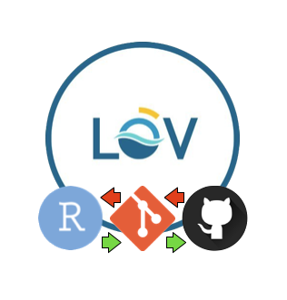

# GitHub tutorial 

This tutorial is presented by [Jérémy Carlot](https://jaycrlt.github.io), as a result of his post-doctoral fellowship with the [Laboratoire d'Océanographie de Villefranche sur mer](https://lov.imev-mer.fr/web/) at [IMEV](https://www.imev-mer.fr/web/#) in France and supervised by [Nuria Teixido](https://orcid.org/0000-0001-9286-2852), [Steeve Comeau](https://orcid.org/0000-0002-6724-5286) and [Jean-Pierre Gattuso](https://orcid.org/0000-0002-4533-4114). 

---
## Participants

<table width="100%" align="center"> <tr> <td width="33.3%" valign="top">

2023:
- [J. Boada](https://orcid.org/0000-0002-3815-625X)
- [D. Moreno Moran](https://orcid.org/0009-0007-2796-2313)
- [E. Nebot-Colomer](https://orcid.org/0000-0003-1013-2405)
- [J. Verdura](https://orcid.org/0000-0003-0662-1206)
- [S. Comeau](https://orcid.org/0000-0002-6724-5286)
- [F. Gazeau](https://orcid.org/0000-0001-8807-4597)
- [N. Teixido](https://orcid.org/0000-0001-9286-2852)
- [F. Picone](https://orcid.org/0000-0001-6903-9665)
- M. Ballin
- R. Torchy

</td> <td width="33.3%" valign="top">
  
2024:
- G. Grasso
- A. Hernandez Ramirez

</td> <td width="33.3%" valign="top">

2025:
- [M. Albo Puigserver](https://orcid.org/0000-0002-0477-5984)
- [M. Cabanellas Reboredo](https://orcid.org/0000-0002-0906-1243)
- [M. Calvo Manazza](https://orcid.org/0000-0002-5745-9790)
- [A. Carreno Castilla](https://orcid.org/0000-0002-1104-4493)
- [A. Gran García](https://orcid.org/0000-0002-7963-2558)
- [J.M. Hidalgo Roldan](https://orcid.org/0000-0002-3494-9658) 
- [G. Kerametsidis](https://orcid.org/0000-0002-6502-8122)
- [E. Nebot-Colomer](https://orcid.org/0000-0003-1013-2405)
- [P. Puerta Ordoñez](https://orcid.org/0000-0003-4413-4601)
- [C. Quiles Pons](https://orcid.org/0009-0005-8859-7191)
- [P. Reglero Baron](https://orcid.org/0000-0002-1093-4750)
- [A. Ruiz Frau](https://orcid.org/0000-0002-1317-2827)

</td> </tr> </table>

---

## RMarkDown Basics

This document is a ``RMarkdown``.\
It will be presented at the beginning, and can / **should** be used to explain to your readers the purpose of this repository.

Because you are working in ecology :seedling:, one of the best use you can do, is to use a GitHub Repository to store:
- Your Data :memo:
- Your Code :computer:
- Your Figures :bar_chart:

Note that you can use emojis to be more friendly.\
You have two options; if you know the [emoji code](https://gist.github.com/rxaviers/7360908), then you can use it. For example, if you want a folder, you can use the code `:file_folder:`. If you don't know the code, you can still copy/paste from an [emoji website](https://getemoji.com).\
You can also refer some keywords to another page using brackets and the URL. To do so, put brackets around the word, or the group of words you want to highlight, followed by the URL in parenthesis.

There are plenty of ways to help your reader and to make your repository fancier. If you're not used to ``RMarkdown``, I recommend having a look at [RMarkdown Cheat Sheet](https://www.markdownguide.org/cheat-sheet/)

You can also make tables, in certain cases, if you feel the need.
Below I show you a silly example, but it can be terrific for data curation use (e.g. [here](https://github.com/JWicquart/gcrmndb_benthos))

**Table 1.** Silly example
People   | Age      | Size    |
--------:|:--------:|:--------|
Jérémy   | 30 yrs   | 173 cm  |
Valentin | 28 yrs   | 176 cm  |

## A well-structured Rmarkdown README is key for reproducibity

But one of the highest strengths of ``RMarkdown``, is that you can write down some ideas or start writing down even for a meeting presentation, including (or not) your R analysis and your outputs. Most of the time, you will work with chunks. If you are interested, we can work on this during another tutorial.

If I mentioned the chunks, it's because I highly suggest launching in the console the ``sessionInfo()`` function once your final R script is done. Then you can copy/paste the different pieces of information into a triple `` ` ``.\
It will highly help the reproducibility of your analyse with your pairs.

```{Session Info, echo = T}
R version 4.2.1 (2022-06-23)
Platform: x86_64-apple-darwin17.0 (64-bit)
Running under: macOS Monterey 12.2.1

Matrix products: default
LAPACK: /Library/Frameworks/R.framework/Versions/4.2/Resources/lib/libRlapack.dylib

locale:
[1] en_US.UTF-8/en_US.UTF-8/en_US.UTF-8/C/en_US.UTF-8/en_US.UTF-8

attached base packages:
[1] stats     graphics  grDevices utils     datasets  methods   base     
```

It is worth to build some hierarchy into your repository,\
I recommend getting always:
- a single ``R`` folder :file_folder:, hosting for your RProj and your R scripts.
- a single ``Data`` folder :file_folder:, hosting for your data you are willing to share.
- a single ``Results`` folder :file_folder:, hosting for your raw or edited Figures.

[Here](https://github.com/JayCrlt/CCA_Methods) is an example of a perfectly reproducible repository.

From here, we can move on and work directly with a case study using R: [``Tutorial R+Git``](https://github.com/JayCrlt/GitHub_Tutorial/blob/main/Courses/Git%2BR.md)
